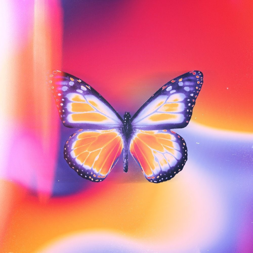

<div align="center">


# Daylight

**Your music. A little brighter.**

An independent Android music player by [sh1vvy](https://github.com/sh1vvy), based on [BitChord](https://github.com/kushagrasinghx/BitChord).

[Source](https://github.com/sh1vvy/daylight) · [Builds](https://github.com/sh1vvy/daylight/actions/workflows/android.yml) · [License](LICENSE) · [Upstream credits](UPSTREAM.md)


</div>

## About

Daylight starts with BitChord’s playback engine and Android interface, with its own name, butterfly icon, warm accent colors, installation identity, and release channel. Android is the supported platform for this fork.

Inherited features include YouTube Music search and playback, local music, downloads, synchronized lyrics, artwork-driven player colors, crossfade, Automix, equalizer, sleep timer, playlists, and optional account integrations. Availability depends on providers and device support. This initial fork changes the product identity; it does not represent a new playback engine.

## Build for Android

Requirements: JDK 17, Android SDK platforms 36 and 37.0, build-tools 35.0.0, Android NDK 27.0.12077973, and CMake 3.22.1. Android 8.0 (API 26) or newer is supported.

Open the repository in Android Studio, or copy `local.properties.example` to `local.properties` and set `sdk.dir` to your SDK directory. Gradle requires a configured Android SDK to include the app module.

```sh
./gradlew :app:assembleDevDebug
./gradlew :app:testDevDebugUnitTest
```

Development APKs are in `app/build/outputs/apk/dev/debug/`. Production APKs use `:app:assembleProdRelease`; without your signing configuration they are unsigned. Configure your own signing key using `keystore.properties.example` before shipping release APKs.

- Production app ID: `com.sh1vvy.daylight`
- Development app ID: `com.sh1vvy.daylight.dev`
- Daylight version: `0.1.3`

Daylight installs alongside BitChord and maintains separate application data. Internal Kotlin namespaces and native entry points are preserved for engine compatibility; see [UPSTREAM.md](UPSTREAM.md).

## GitHub builds

The [Android workflow](.github/workflows/android.yml) runs Android unit tests and produces a debug APK plus production APKs. Release signing is optional: configure `KEYSTORE_BASE64`, `KEYSTORE_PASSWORD`, `KEY_ALIAS`, and `KEY_PASSWORD` repository secrets to sign production builds. With no signing secrets, the workflow produces unsigned production APKs and an installable development APK. The workflow does not publish releases automatically.

Daylight checks [its own GitHub releases](https://github.com/sh1vvy/daylight/releases) for updates. Publish only Daylight APKs there, signed consistently with your own key.

## Optional integrations

Set these in the ignored `local.properties` file or as build environment variables:

| Setting | Purpose |
| --- | --- |
| `LISTEN_TOGETHER_SERVER` | Optional party server override; defaults to `https://jam.sh1vvy.com`. |
| `LASTFM_API_KEY`, `LASTFM_SECRET` | Your Last.fm app credentials. |
| `DISCORD_APPLICATION_ID` | Your Discord application ID for presence artwork and buttons; empty by default. |

Daylight does not report installations to BitChord’s live usage counter. Jam runs on Daylight’s own Cloudflare service at [jam.sh1vvy.com](https://jam.sh1vvy.com). Shared invites use its HTTPS invitation pages and open Daylight. See [Cloudflare Jam setup and free-tier limits](cloudflare-jam/README.md). The original Go backend remains in `backend/` as a reference and alternative deployment.

## Attribution and license

BitChord was created by **Kushagra Singh and its contributors**. Daylight retains their Git history, copyright notices, and the **GNU General Public License v3.0**. See [LICENSE](LICENSE), [UPSTREAM.md](UPSTREAM.md), and [original contributor credits](docs/UPSTREAM_MAINTAINERS.md).

Daylight uses [Inter 4.1 and Inter Display](https://rsms.me/inter/) by Rasmus Andersson throughout its interface, lyrics, widgets, and shared image cards, distributed under the [SIL Open Font License](docs/licenses/Inter-OFL.txt). The license is also bundled with the app.

**© art by 11 ([_artbyeleven on IG](https://www.instagram.com/_artbyeleven/))**. The launcher uses the supplied butterfly artwork; in-app branding uses a flat butterfly mark adapted from it. The artist credit is also included in Settings and the app’s assets.

Daylight is independent of BitChord’s maintainers and is not affiliated with YouTube, Google, Spotify, Discord, or other service providers. Provider names identify integrations. If you distribute this derivative, provide its corresponding source under GPLv3.
