

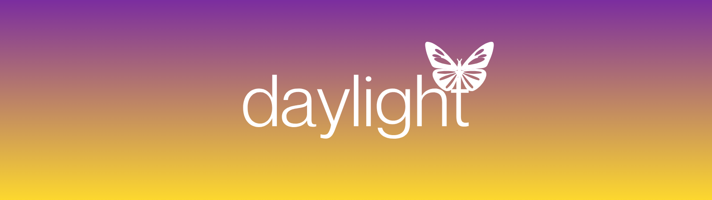

<strong>An open-source Android music player.</strong> YouTube Music streaming, optional lossless audio, synced lyrics and shared listening.

<a href="https://github.com/sh1vvy/daylight/releases/latest/download/daylight.apk">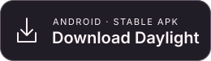</a>
<a href="https://github.com/sh1vvy/daylight/releases/download/v0.2.2-dev.9/daylight-dev.apk">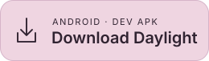</a>

**Stable 0.2.1** · **Dev 0.2.2-dev.9**

[Website](https://daylight.sh1vvy.com) · [Release notes](https://github.com/sh1vvy/daylight/releases) · [Daylight Jam](https://jam.sh1vvy.com) · [Report an issue](https://github.com/sh1vvy/daylight/issues)

## Screenshots

<a href="docs/screenshots/home-dev8.webp">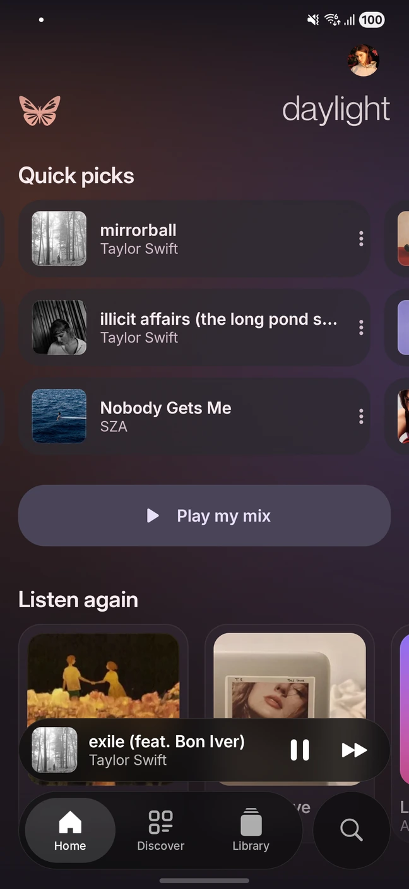</a>
<a href="docs/screenshots/player-dev8.webp">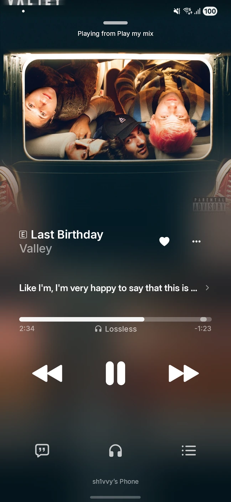</a>
<a href="docs/screenshots/library-dev8.webp">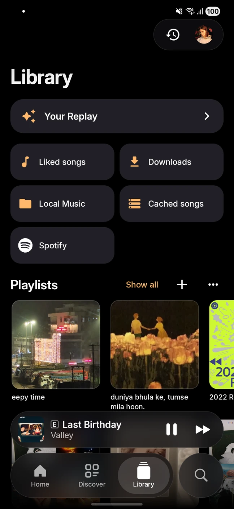</a>

Home · Now playing · Library Captured in Dev.8 on Android. Tap any screenshot to view it at full size.

## Features

| Feature | Details |
| :--- | :--- |
| **YouTube Music** | Search songs, videos, albums, artists and playlists. Sign in for your library and personalized recommendations. |
| **Lossless audio BETA** | Optional verified FLAC playback, with Lossless and Hi-Res Lossless quality tiers. The player labels the format actually playing. |
| **Listen together** | Create or join a Jam, share an invite link and listen in sync with a shared queue. |
| **Automix BETA** | Beat-aware transitions with a subtle progress glow and a blend between the current and next cover. |
| **Quick picks and Play my mix** | Start with familiar tracks and recommendations, or build an ongoing personal mix with one tap. Tune recommendation languages in settings. |
| **Synced lyrics** | Follow timed lyrics, with optional translation and romanization. |
| **Library and playlists** | Open your cached Liked songs list immediately. Edit playlist names and covers, and find recently used playlists first. |
| **Spotify playlists** | Play connected Spotify playlists through matched YouTube Music tracks. Played playlists appear in Library and Listen again. |
| **Themes and artwork** | Dark, Light and Pink Clouding themes, optional liquid glass, full-screen artwork and animated covers. |
| **Playback tools** | Offline downloads, local audio, equalizer, crossfade, sleep timer and queue controls. Disliked tracks stay out of automatic playback. |
| **Replay and integrations** | Listening statistics, Android home-screen widgets, Last.fm scrobbling and Discord presence. |

These features describe the current development build. Lossless availability depends on the track and connection; Jams use YouTube Music audio. Automix supports normal and Lossless audio, with Hi-Res excluded.

## Feature previews

<table>
<tr>
<th width="50%">Automix BETA</th>
<th width="50%">Synced lyrics</th>
</tr>
<tr>
<td align="center"><a href="https://daylight.sh1vvy.com/#automix">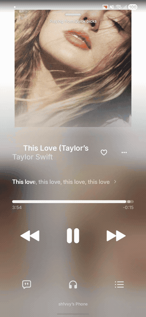</a></td>
<td align="center"><a href="https://daylight.sh1vvy.com/#lyrics">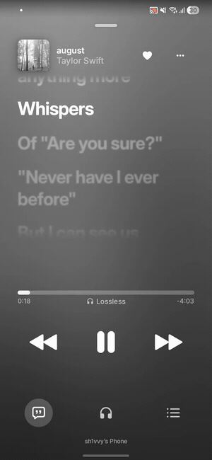</a></td>
</tr>
</table>

Recorded in the app. Select a preview to open its section on the website.

### Liquid glass

<a href="https://daylight.sh1vvy.com/#glass">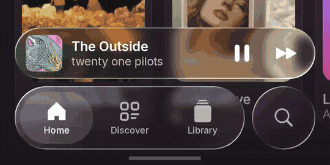</a>

Glass controls are optional on Android 12 and newer. Navigation and the compact player also work with glass disabled.

## Themes

<a href="docs/screenshots/theme-light-dev8.webp">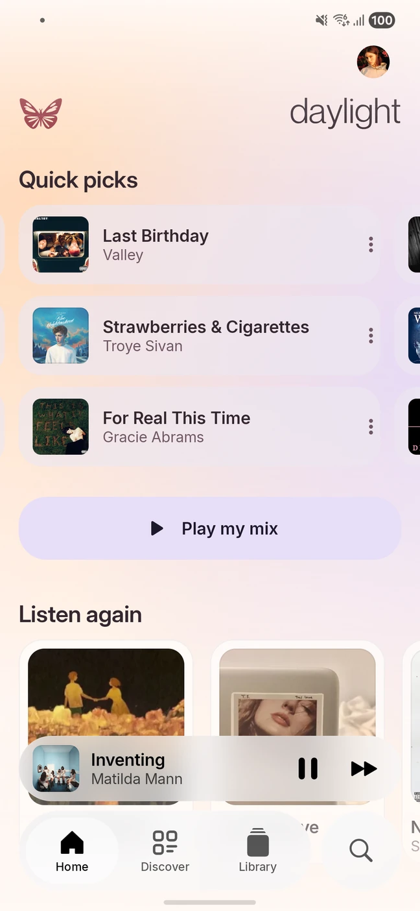</a>
<a href="docs/screenshots/theme-pink-dev8.webp">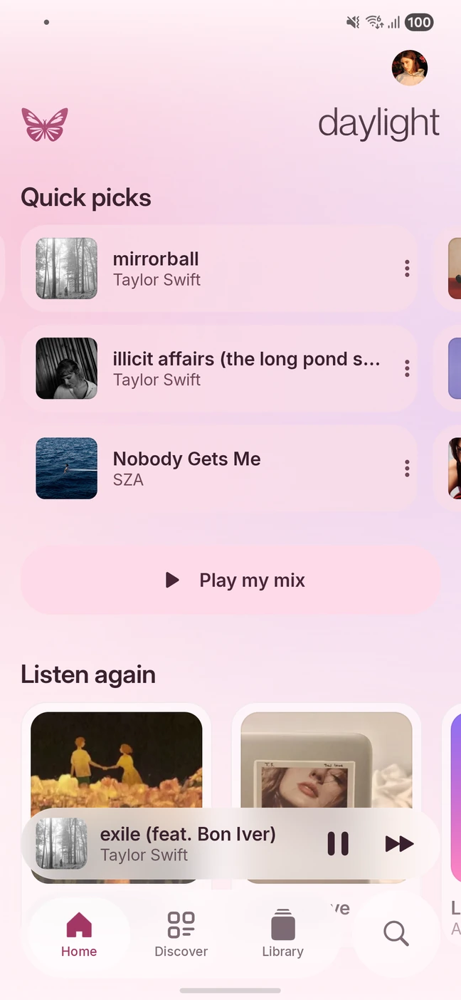</a>

Dark · Light · Pink Clouding BETA Follow the system theme or choose one in Appearance settings.

<strong>Discover and the player menu</strong>

<a href="docs/screenshots/discover-dev8.webp">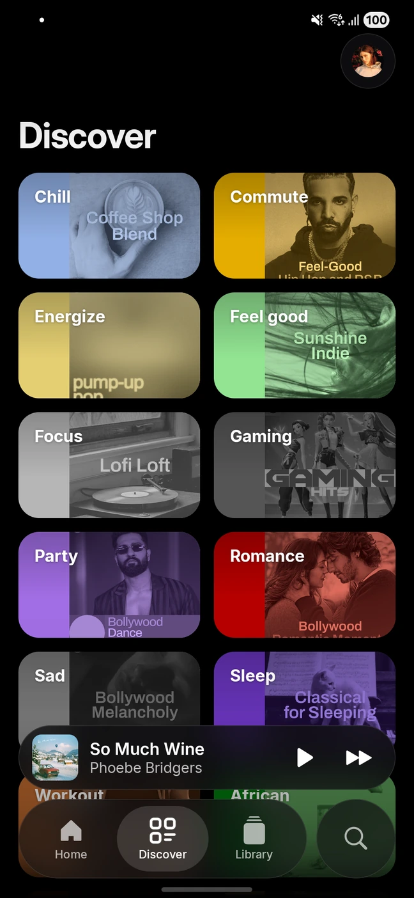</a>
<a href="docs/screenshots/player-menu-dev8.webp">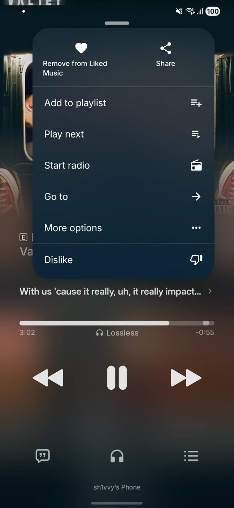</a>

## Download and install

Requires **Android 8.0 or newer**. Download the APK for your channel, open it and approve installation when Android asks.

| Channel | Version | Download |
| :--- | :--- | :--- |
| **Stable** | 0.2.1 | [daylight.apk](https://github.com/sh1vvy/daylight/releases/latest/download/daylight.apk) |
| **Dev** | 0.2.2-dev.9 | [daylight-dev.apk](https://github.com/sh1vvy/daylight/releases/download/v0.2.2-dev.9/daylight-dev.apk) |

Stable and Dev install separately. Keep the same channel when updating to preserve its data. Public builds offer an in-app update prompt; Android still asks you to confirm installation. From an internal Canary, install the matching Dev APK manually once to resume public Dev updates.

Sign in to YouTube Music for personalized recommendations, your online library, **Play my mix** and **Jams**. General search and playback also work without sign-in.

## Build and contribute

Daylight currently supports Android. Start with the [development guide](docs/DEVELOPMENT.md) for requirements, builds and tests. Report reproducible problems in [Issues](https://github.com/sh1vvy/daylight/issues), including your app version, Android version and device model.

[Release guide](docs/ANDROID_RELEASES.md) · [Performance notes](docs/PERFORMANCE.md) · [Lossless notes](docs/LOSSLESS_BETA.md) · [Jam service](cloudflare-jam/README.md)

## Credits and license

Developed by **[sh1vvy](https://sh1vvy.com)**. Licensed under **[GNU GPL v3.0](LICENSE)**. Original copyright notices and corresponding source are retained.

Based on **BitChord**.

- **Butterfly artwork:** © art by 11 ([_artbyeleven on IG](https://www.instagram.com/_artbyeleven/)).
- **Wordmark:** [vector artwork](docs/assets/daylight-wordmark.svg) supplied by sh1vvy.
- **Typography:** [Inter](https://rsms.me/inter/) by Rasmus Andersson, under the [SIL Open Font License](docs/licenses/Inter-OFL.txt).
- **Discover icon:** [M Yudi Maulana / Noun Project](app/src/main/assets/credits/Discover.txt), under [CC BY 3.0](https://creativecommons.org/licenses/by/3.0/).

Daylight is not affiliated with YouTube, Google, Spotify, Last.fm or other integrated services. Music artwork in screenshots belongs to its respective owners.
