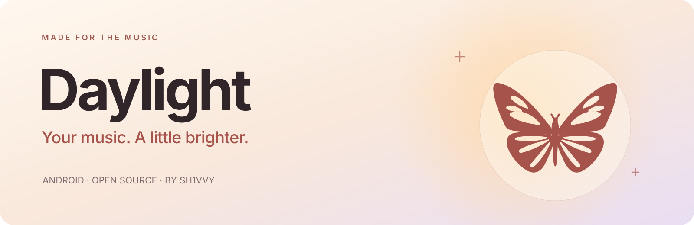
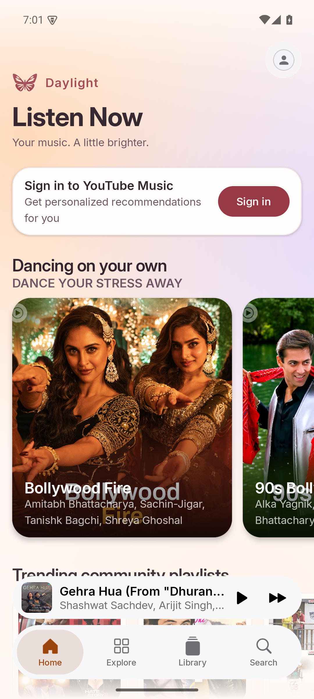
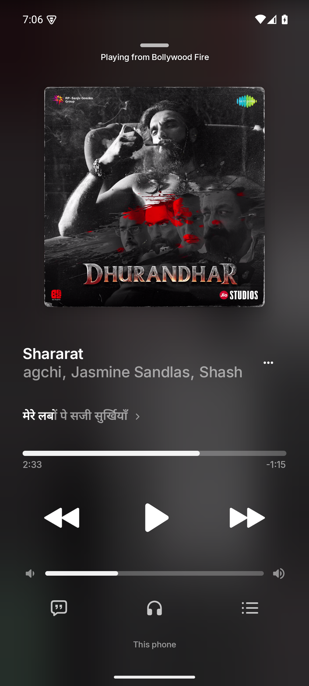
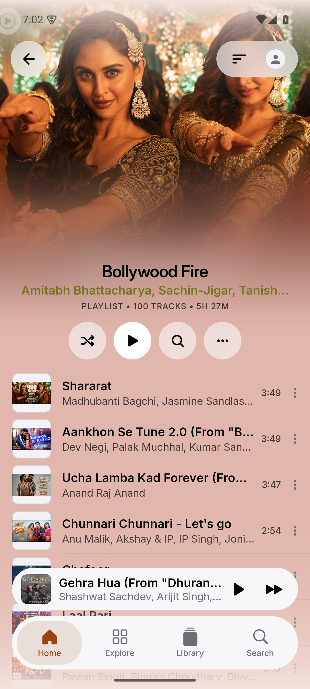
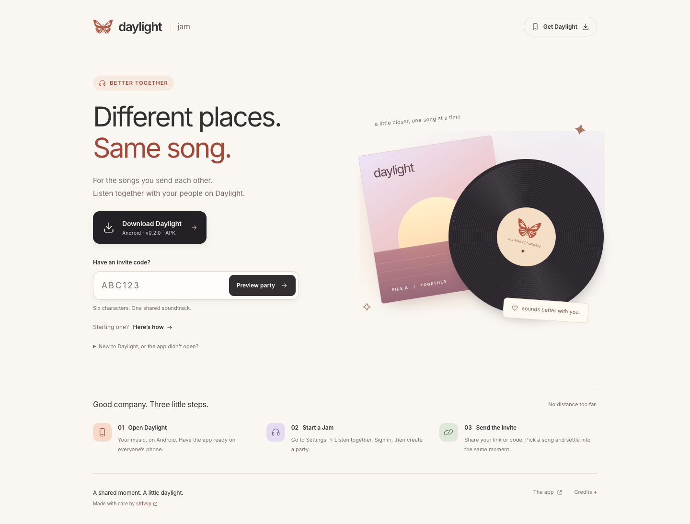

# Daylight

**Your music. A little brighter.**

A music player for Android, made for your favorite songs and the people you share them with. Warm colors. Beautiful lyrics. A little room to breathe.

 

[Release notes](https://github.com/sh1vvy/daylight/releases/latest) · [Listen together](https://jam.sh1vvy.com) · [Report an issue](https://github.com/sh1vvy/daylight/issues)

## A little look inside

  
  
  

Home · Now playing · Playlists Captured in the Android app. Tap a screenshot for a closer look.

## Made for the way you listen

| Made for | What you get |
| :--- | :--- |
| **Find your next favorite** | Search and play music from YouTube Music. Browse albums, artists, and playlists, with optional sign-in for personalized recommendations. |
| **Keep your music close** | Play local audio, organize your library, and download tracks for offline listening. |
| **Feel every line** | Follow synchronized lyrics with clear Inter typography, a spacious reading view, and source credits tucked at the bottom. |
| **Make it feel like you** | Choose light or dark mode, glass controls, and player colors drawn from the artwork. |
| **Let the music flow** | Shape playback with crossfade, Automix, an equalizer, queue controls, and a sleep timer. |
| **Share the moment** | Start a Jam, send a link or code, and listen in sync with your people. |
| **Little comforts** | Cached artwork, less repeated playlist loading, and update prompts right inside the app. |

Some music, lyrics, and audio options depend on the provider and your device.

## Different places. Same song.

**Daylight Jam** is for the songs you send each other. Create a party in the app, share your invite, and settle into the same soundtrack.

[Start with Daylight Jam →](https://jam.sh1vvy.com)

## Get Daylight

**Android 8.0 or newer.** Download the signed **[daylight.apk](https://github.com/sh1vvy/daylight/releases/latest/download/daylight.apk)** from the latest release, then open it to install. Android may ask you to allow installation from your browser.

Already using **Daylight Dev**? Keep that installation and use its in-app update popup, or download the matching **[daylight-dev.apk](https://github.com/sh1vvy/daylight/releases/latest/download/daylight-dev.apk)**.

For future updates, fully close and reopen the app. When a newer release is available, Daylight offers a download and opens Android's installer for your confirmation. Android may first ask you to allow installs from Daylight; return to the app and tap Install again afterward.

## For the curious

Want to build, contribute, or see what happens under the covers?

[Development guide](docs/DEVELOPMENT.md) · [Release guide](docs/ANDROID_RELEASES.md) · [Performance notes](docs/PERFORMANCE.md) · [Jam server](cloudflare-jam/README.md)

## Credits & license

Made with care by **[sh1vvy](https://sh1vvy.com)**. Daylight is free and open source under the **[GNU GPL v3.0](LICENSE)**; original copyright notices and corresponding source remain available.

Based on **BitChord**.

**© art by 11 ([_artbyeleven on IG](https://www.instagram.com/_artbyeleven/))** — butterfly artwork and the mark adapted from it.

**[Inter](https://rsms.me/inter/)** by Rasmus Andersson — typography, under the [SIL Open Font License](docs/licenses/Inter-OFL.txt).

Service names and artwork

Daylight is not affiliated with YouTube, Google, Spotify, Discord, or other service providers. Their names identify integrations. Music artwork shown in screenshots belongs to its respective owners.

A shared moment. A little daylight.

